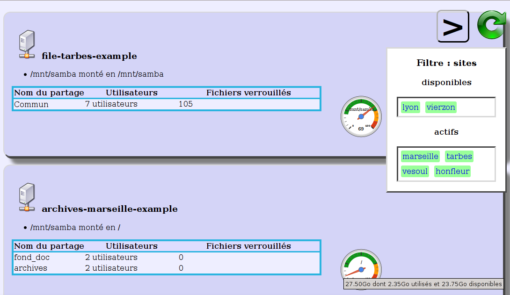
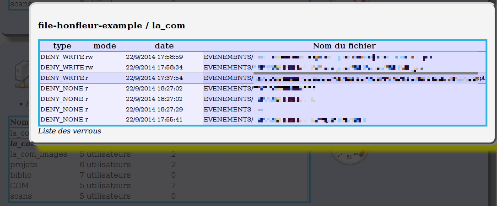
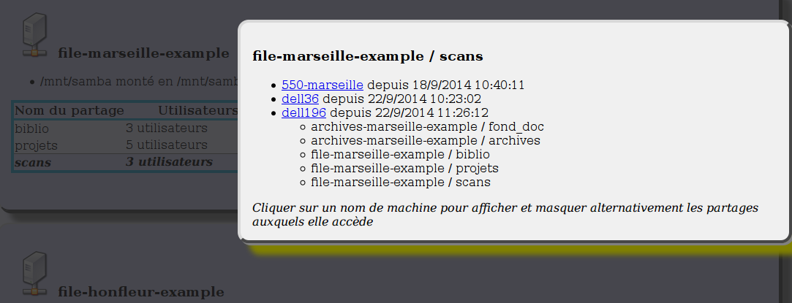

samba_report_html
=================

.. contents::

Description
------------

.. _samba_report_module: https://github.com/majerteam/samba_report_module

HTML+js frontend for samba_report_module_ and salt recipe to deploy and use it.

Contents
~~~~~~~~~

Static files
.............

There are some HTML Javascript and CSS files in ``deployfiles``,  that can be served statically from their place.

The javascript takes care of fetching and presenting the data in a file named ``samba_summary.json``; the latter being generated by painlessly aggregating the output of samba_report_module_ all around your servers.

Salt config
............

In ``conffiles/saltmaster.sls``, there is a little salt config for convenience:

* it installs relevant files from ``deployfiles`` in ``/var/www``.
* it schedules a salt call every minute in order to produce the data consumed by
  the javascript.

Credits
---------

Files that are copied here, mainly for convenience.

* gauge.js:

  * Copied at https://gist.github.com/tomerd/1499279
  * Author: tomer doron https://github.com/tomerd http://tomerdoron.blogspot.fr/

* d3.js, jquery min, for convenience.

Thanks a lots to all imported authors!

Screenshots!
------------

Main view
~~~~~~~~~~

The page consists of :

* on the right: a few controls that can be toggled
* a succession of blocks, one per server, with:

  * the server name
  * the correspondence between samba exported directories and filesystems
  * the list of samba shares, with

    * current number of users
    * current number of locked files

  * a gauge showing how much space is left of the supporting filesystems.

Locked files
~~~~~~~~~~~~~

Upon clicking on a cell in the locked files column (showing a non-zero value), you can access the list of locked files.

User list
~~~~~~~~~~~~~

Upon clicking on a cell in the users column (showing a non-zero value), you can access the list of machines connected to the share.

Clicking the name of a machine toggles a list of all shares this machine is currently accessing.

Notes on implementation
------------------------

I am not very proficient in HTML, JS or design, but I enjoyed writing this.

`Salt is not going to spit consumable json <https://github.com/saltstack/salt/issues/1685>`_ unless given the ``--static`` flag. This has inconveniences, that we are likely to circumvented if we used a storage such as couchdb. I hope to look into this (there is a salt returner for couchdb and couchdb seems to be HTTP+javascript friendly).

Why this project
-----------------

For a start, I needed to have a centralized view of samba usage, because it is critical to avoid disconnecting people when they work on locked files: this could void days of work.

Images
------

Images : specific (c), I took them in oxygen : http://www.oxygen-icons.org/
